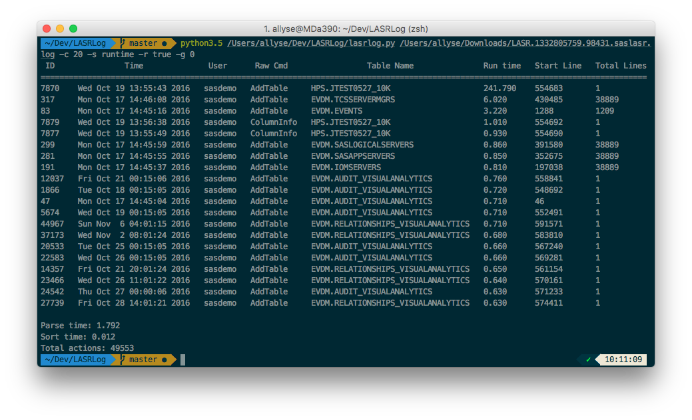

# Overview
The LASRLog.py utility provides information about LASR actions with a high run time

# Prerequisites

- Python 3 and above
- Texttable

# Usage

python3.5 lasrlog.py /Users/alexal/Downloads/LASR.1332805759.98431.saslasr.log 20

# Screenshot

